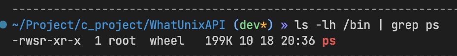

## 文件权限管理
有些文件你可以打开，有些文件你无法打开，因为文件有一套权限管理机制。  


`-rw-r--r--`描述的就是文件权限  

开头的`-`表示文件类型是**普通文件**，如果开头是`d`表示文件类型是**文件夹**。

`rw-r--r--`三位一组，分成三组，从左到右依次代表：
user - 文件拥有者的权限；
group - 文件所属组的权限；
other - 其他情况下文件的权限；

`rw-` 表示：
`r` - 文件拥有者有读权限；
`w` - 文件拥有者有写权限；
`-` - 文件拥有者没有执行该文件的权限；

请留意第三位：
如果是`x`，则拥有者具有执行该文件的权限；
如果是`s`，表示在执行该文件的时候，可以将进程的有效用户ID设置为文件拥有者ID，允许实际用户执行该文件；
> `rwx` 在 chmod 函数中，等于 4 + 2 + 1 = 7;
> `r` 对应 `<fcntl.h>` 中的S_IRUSR 宏，这个宏等于0400,这是一个8进制数据，低2位的0，对应group other 权限，如果单看user位置的权限，`r` 就是 4；
> `s` 对应 S_ISUID 宏，这个宏等于 0x04000;

更多的字母含义See: `man ls`


为了加深印象，再看几个问题

#### 为什么我们可以在shell中执行`ls -lh` ?
你执行一下`ls -lh /bin` 就可以发现，ls 这个可执行文件的拥有者是 `root`


尽管 ls 属于root， root具备超管权限，但并不意味着我们必须要有超管权限才能执行它。  

请看 ls 文件的权限:
  user:  `rwx` 
  group: `r-x`
  other: `r-x`

我们不是root，也和root不在同一个组wheel中，所以 other 表示的才是我们有什么权限，显然我们有读权限和执行权限，我们当然可以执行 ls 的。  


#### ps 权限中的 s 干啥用的？


ps 文件的权限：
user: `rws`
group: `r-x`
other: `r-x`

`s`表示二进制文件 `ps` 的设置用户ID位被启用。当使用 exec 系统调用加载该文件到进程时，会将进程的有效用户ID设置为`ps`文件的用户ID（也就是root）。

#### 为什么 nginx 启动时，要加上 sudo ?
nginx 作为守护进程，需要充分访问文件系统，nginx必须要拥有root权限；而 nginx 属于用户进程，是我们编译源码得到的，不是root一开始写好放入操作系统的，所以nginx没有root权限。

执行 `ls -lh /bin | grep sudo`, 你会发现 sudo 文件权限设置了 `s`，这样在执行的时候，sudo 进程就可以将 euid 设置为 root 的 id，拿到 root 权限。更确切的说，sudo 可以令实际用户ID和有效用户ID都变成0.

你可以用一个简单的 c 程序感受一下：
```c
#include <stdio.h>
#include <unistd.h>

int main() {
    uid_t ruid = getuid();
    uid_t euid = geteuid();

    printf("ruid: %d, euid: %d\n", ruid, euid);

    return 0;
}
```
编译后，直接执行一次，再加上 sudo 执行一次。
第一次打印的是你的 id 值；
第二次打印的是 0，也就是 root 的 id 值。

> 在macOS，sudo 获取的并不是最高超管权限，因为 macOS 拥有一个叫做 SPI 的机制，会阻止你编写的程序获取更高的权限，不信的话，你可以执行一下 `dtruss ls`, 再执行一下 `sudo dtrucc ls`, 你会发现二者都不管用。

<br>

#### 文件拥有者的ID等于进程实际用户ID，还是有效用户ID？
文件是通过进程执行相应的API创建的，而因此文件拥有者的ID等于创建该文件的进程的有效用户ID。详见[用户ID章节](../进程/%E7%94%A8%E6%88%B7ID/main.c)。

<br>

#### 文件组ID就是进程的有效组ID吗？
一般来讲是这样的，但还有一种情况是文件组ID是文件所在目录的组ID。

当对文件权限的 group 设置 `s` 时，文件的 set-group-id 位就被设置了，此时文件的group id 值，等于 文件所在目录的 group id 值。

<br>
<br>

## API 快览
校验文件访问权限 - access
改变当前工作目录 - chdir
改变文件的权限   - chmod
改变文件拥有者   - chown
删除文件        - remove
重命名文件      - rename
遍历目录        - readdir
获取文件描述信息（权限，拥有者ID，组ID等）  - stat
设置文件权限屏蔽码 - umask
删除空目录        - rmdir
创建硬链接       - link
创建软连接       - symlink